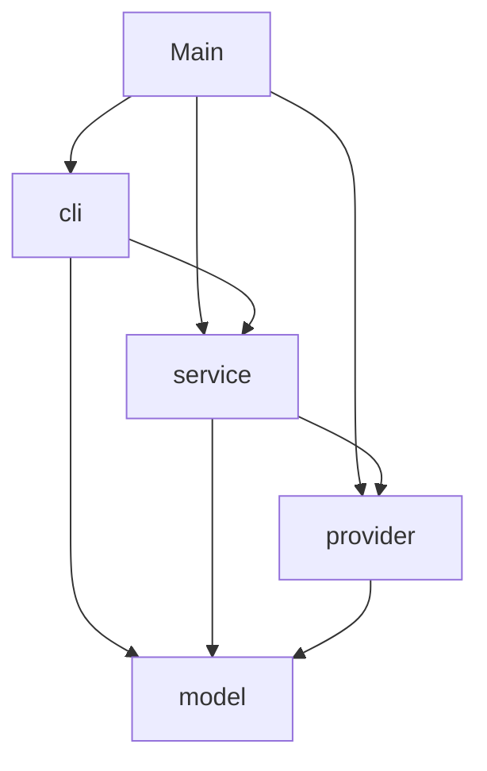

# Weather Information Service — Architecture

**Status:** Proposed design (signatures only, no implementation)
**Course:** CS 342 Software Design, Project 1
**Java:** 25 · **Build:** Maven · **Tests:** JUnit Jupiter 5 + Mockito

---

## Contents

1. [Goals](#1-goals)
2. [Design principles](#2-design-principles)
3. [Package layout](#3-package-layout)
4. [Dependency graph](#4-dependency-graph)
5. [Model](#5-model-weathermodel)
6. [Provider](#6-provider-weatherprovider)
7. [Service](#7-service-weatherservice)
8. [CLI](#8-cli-weathercli)
9. [Composition root](#9-composition-root)
10. [Request flow](#10-request-flow)
11. [Error handling](#11-error-handling)
12. [Testing strategy](#12-testing-strategy)
13. [Extension guide](#13-extension-guide)
14. [Build configuration](#14-build-configuration)
15. [Rubric traceability](#15-rubric-traceability)
16. [Implementation order](#16-implementation-order)
17. [Decision log](#17-decision-log)

---

## 1. Goals

The assignment's central question:

> If the real weather API were replaced with a completely different source of weather data, how much of your program would you have to rewrite?

**Target answer:** one new class that implements `WeatherDataProvider`, plus one line in `Main`. The model, service, CLI, and every test outside the provider stay the same. The new source can use HTTP, a file, a database, a different API, or an in-memory map.

Secondary goals:

- Every class can be tested in isolation, without a network.
- You can add a command, a location source, a summary style, or a provider-level behavior (such as caching) by **adding** a class, not by editing existing ones.
- Failures are always reported explicitly. No `null`, and no placeholder data like the starter's `72.0`.

---

## 2. Design principles

| Principle | How it shows up |
|---|---|
| **Single responsibility** | Each class has one reason to change. For example, `OpenMeteoResponseParser` changes only when Open-Meteo's JSON changes. |
| **Depend on abstractions** | `WeatherService` depends on `WeatherDataProvider`, `LocationRepository`, and `WeatherSummarizer`, all interfaces. |
| **Constructor injection** | Every collaborator is a `final` field set by the constructor. No class creates its own dependencies, except for the convenience constructors listed in §9. |
| **Open/closed** | New commands, providers, and summarizers are new classes. Existing classes don't change. |
| **Information hiding** | Provider internals (JSON, HTTP, WMO codes) are package-private. The compiler blocks the rest of the app from touching them. |
| **Immutable model** | All model types are records or enums, with validation in compact constructors. |
| **Pure core, I/O at the edges** | Model and service logic are deterministic. I/O happens only in the provider (network) and the CLI (console). |
| **Composition root** | `Main` is the only place concrete classes are wired together. |

---

## 3. Package layout

Files marked **(R)** are required by the assignment (§8). Every other file supports one of them.

```
src/main/java/weather/
├── Main.java                                  (R) composition root
│
├── model/                                     plain data, no I/O, depends on nothing
│   ├── Location.java                          (R) record
│   ├── WeatherData.java                       (R) record
│   ├── Wind.java                              record
│   ├── WeatherCondition.java                  enum
│   ├── UnitSystem.java                        enum
│   ├── UnitConverter.java                     final utility: WeatherData → other UnitSystem
│   └── WeatherComparison.java                 record with derived differences
│
├── provider/                                  where weather data comes from
│   ├── WeatherDataProvider.java               (R) interface: the seam
│   ├── WeatherProviderException.java          checked exception
│   ├── OpenMeteoWeatherProvider.java          (R) HTTP transport for Open-Meteo
│   ├── OpenMeteoResponseParser.java           package-private: JSON → WeatherData
│   └── CachingWeatherProvider.java            optional decorator (stretch goal)
│
├── service/                                   application logic
│   ├── WeatherService.java                    (R) use cases
│   ├── LocationRepository.java                interface: source of known locations
│   ├── InMemoryLocationRepository.java        default implementation
│   ├── WeatherSummarizer.java                 interface: WeatherData → sentence
│   ├── DefaultWeatherSummarizer.java          default implementation
│   └── UnknownLocationException.java          checked exception
│
└── cli/                                       text in, text out
    ├── WeatherCLI.java                        (R) REPL loop and dispatch
    ├── CommandLineTokenizer.java              "compare Chicago \"New York\"" → tokens
    ├── CommandRegistry.java                   name → CommandHandler
    ├── CommandHandler.java                    interface: one command
    ├── CommandContext.java                    what a handler may use
    ├── UsageException.java                    bad arguments for a known command
    ├── WeatherFormatter.java                  model → display strings
    └── commands/                              one class per command
        ├── HelpCommand.java
        ├── LocationsCommand.java
        ├── CurrentCommand.java
        ├── CompareCommand.java
        ├── SummaryCommand.java
        ├── CompareAllCommand.java             additional feature
        ├── WarmestCommand.java                additional feature
        ├── ColdestCommand.java                additional feature
        ├── UnitsCommand.java                  additional feature
        └── QuitCommand.java
```

---

## 4. Dependency graph

Arrows mean "depends on". Dependencies only point downward, and there are no cycles.



Rules:

- `model` imports nothing from `weather.*`.
- `cli` imports the `provider` package only to catch `WeatherProviderException`. It never names a provider class.
- `service` never imports `java.net.*`, `java.io.*`, or JSON types.
- `provider` never imports `service` or `cli`.

The key relationship from the assignment:

```
WeatherService ──► WeatherDataProvider ◄── OpenMeteoWeatherProvider
                                      ◄── CachingWeatherProvider  (wraps any provider)
                                      ◄── FakeWeatherDataProvider (tests)
                                      ◄── <any future provider>
```

---

## 5. Model (`weather.model`)

The model holds only data and invariants. It has no I/O and knows nothing about Open-Meteo.

### `Location`

```java
public record Location(String name, double latitude, double longitude) {
    // compact ctor: name non-blank (trimmed), latitude ∈ [-90, 90], longitude ∈ [-180, 180]
    //               → IllegalArgumentException
}
```

### `UnitSystem`

```java
public enum UnitSystem {
    METRIC  ("°C", "km/h", "mm"),
    IMPERIAL("°F", "mph",  "in");

    private final String temperatureSymbol;
    private final String speedSymbol;
    private final String precipitationSymbol;

    public String temperatureSymbol();
    public String speedSymbol();
    public String precipitationSymbol();
}
```

### `WeatherCondition`

```java
public enum WeatherCondition {
    CLEAR, MAINLY_CLEAR, PARTLY_CLOUDY, OVERCAST, FOG,
    DRIZZLE, FREEZING_DRIZZLE, RAIN, FREEZING_RAIN, RAIN_SHOWERS,
    SNOW, SNOW_GRAINS, SNOW_SHOWERS, THUNDERSTORM, THUNDERSTORM_WITH_HAIL,
    UNKNOWN;

    private final String description;       // "light rain", "overcast", …
    public String description();
}
```

This type has no WMO codes. Translating a provider's codes into this enum is that provider's job, so a provider that uses text labels maps those instead.

### `Wind`

```java
public record Wind(double speed, int directionDegrees, double gusts) {
    // compact ctor: speed ≥ 0, gusts ≥ 0, directionDegrees ∈ [0, 360]
    public String compassDirection();       // 16-point: "N", "NNE", …, "NNW"
}
```

### `WeatherData`

```java
public record WeatherData(
        Location location,
        double temperature,
        double apparentTemperature,         // "feels like"
        int relativeHumidity,               // %
        double precipitation,
        int cloudCover,                     // %
        Wind wind,
        WeatherCondition condition,
        LocalDateTime observedAt,           // local time at the location
        UnitSystem units                    // system the numeric fields are expressed in
) {
    // compact ctor: no nulls; relativeHumidity, cloudCover ∈ [0, 100];
    //               precipitation ≥ 0; temperatures finite → IllegalArgumentException
}
```

The `units` field lets every provider return data in whatever unit system it naturally uses. The service then normalizes the data, and the formatter reads the unit labels from the data instead of assuming them.

### `UnitConverter`

```java
public final class UnitConverter {
    private UnitConverter() {}

    public static WeatherData convert(WeatherData data, UnitSystem target);   // identity if already target

    static double celsiusToFahrenheit(double celsius);
    static double fahrenheitToCelsius(double fahrenheit);
    static double kmhToMph(double kmh);
    static double mphToKmh(double mph);
    static double mmToInches(double mm);
    static double inchesToMm(double inches);
}
```

This is a stateless utility, so it's fine as a static class: it has no I/O and nothing a test would ever need to swap out. Keeping it separate means `WeatherData` stays plain data.

### `WeatherComparison`

```java
public record WeatherComparison(WeatherData first, WeatherData second) {
    // compact ctor: non-null; first.units() == second.units()

    public double temperatureDifference();              // first − second
    public double apparentTemperatureDifference();
    public int    humidityDifference();
    public double windSpeedDifference();
    public double precipitationDifference();

    public WeatherData warmer();
    public WeatherData cooler();
    public WeatherData windier();
    public WeatherData moreHumid();
}
```

---

## 6. Provider (`weather.provider`)

### `WeatherDataProvider`: the seam

```java
public interface WeatherDataProvider {
    /**
     * Returns current conditions at the given location.
     *
     * The returned data may be in any UnitSystem; it declares its own units.
     * Never returns null. Never substitutes placeholder values.
     *
     * @throws WeatherProviderException if the data cannot be obtained or is invalid,
     *         for any reason: transport, protocol, format, or content.
     */
    WeatherData getCurrentWeather(Location location) throws WeatherProviderException;
}
```

The interface has one method, and none of its types mention HTTP, JSON, or files. That's what lets a provider use any transport.

### `WeatherProviderException`

```java
public class WeatherProviderException extends Exception {
    public WeatherProviderException(String message);
    public WeatherProviderException(String message, Throwable cause);
}
```

The message is written for the user, for example `Could not reach Open-Meteo: connection timed out`. The CLI prints it as-is.

### `OpenMeteoWeatherProvider`

This class handles transport only. It builds the URI, sends the request, and checks the status code. It delegates everything about JSON to the parser.

```java
public final class OpenMeteoWeatherProvider implements WeatherDataProvider {
    static final URI DEFAULT_BASE_URI = URI.create("https://api.open-meteo.com/v1/forecast");
    static final List<String> CURRENT_FIELDS = List.of(
            "temperature_2m", "apparent_temperature", "relative_humidity_2m",
            "precipitation", "weather_code", "cloud_cover",
            "wind_speed_10m", "wind_direction_10m", "wind_gusts_10m");
    static final Duration REQUEST_TIMEOUT = Duration.ofSeconds(10);

    private final HttpClient httpClient;
    private final URI baseUri;
    private final OpenMeteoResponseParser parser;

    public OpenMeteoWeatherProvider(HttpClient httpClient);                 // production
    OpenMeteoWeatherProvider(HttpClient httpClient, URI baseUri,
                             OpenMeteoResponseParser parser);               // package-private, tests

    @Override
    public WeatherData getCurrentWeather(Location location) throws WeatherProviderException;

    URI buildUri(Location location);                                       // package-private for testing
    private String fetch(URI uri) throws WeatherProviderException;
    //   IOException          → WPE("Could not reach Open-Meteo: …", cause)
    //   InterruptedException → restore interrupt flag, WPE("Request interrupted", cause)
    //   status ≠ 200         → WPE("Open-Meteo returned HTTP <status>")
}
```

`Main` creates the `HttpClient` and injects it. The request is synchronous (`HttpClient.send`), because §19 forbids async calls.

### `OpenMeteoResponseParser`

```java
final class OpenMeteoResponseParser {                    // package-private
    private final ObjectMapper mapper;

    OpenMeteoResponseParser();
    OpenMeteoResponseParser(ObjectMapper mapper);

    WeatherData parse(String json, Location location) throws WeatherProviderException;
    //   1. readTree; JsonProcessingException → WPE("Malformed response from Open-Meteo", cause)
    //   2. root.error == true → WPE(root.reason)
    //   3. root.current missing → WPE("Open-Meteo response has no 'current' block")
    //   4. read each field via required*(); build Wind, WeatherData with units = METRIC
    //   5. IllegalArgumentException from a record ctor → WPE("Open-Meteo returned an invalid value: …", cause)

    private static double requiredDouble(JsonNode node, String field) throws WeatherProviderException;
    private static int    requiredInt   (JsonNode node, String field) throws WeatherProviderException;
    private static String requiredText  (JsonNode node, String field) throws WeatherProviderException;
    static WeatherCondition conditionFromWmoCode(int code);    // the only place WMO codes appear
}
```

Because this class is package-private, raw JSON can't reach the service or CLI. The compiler enforces that.

### `CachingWeatherProvider` (stretch goal)

```java
public final class CachingWeatherProvider implements WeatherDataProvider {
    private final WeatherDataProvider delegate;
    private final Clock clock;
    private final Duration timeToLive;
    private final Map<Location, CachedEntry> cache;         // HashMap; no threads in this project

    public CachingWeatherProvider(WeatherDataProvider delegate, Duration timeToLive, Clock clock);

    @Override
    public WeatherData getCurrentWeather(Location location) throws WeatherProviderException;
    //   fresh entry → return it; otherwise delegate, store, return. Failures are never cached.

    private record CachedEntry(WeatherData data, Instant fetchedAt) {}
}
```

This is a decorator: it adds behavior to *any* provider without changing that provider or the service. It's useful because `compareall`, `warmest`, and `coldest` each fetch every location. Injecting `Clock` lets tests control expiry deterministically. It's optional; the design is complete without it.

---

## 7. Service (`weather.service`)

### `LocationRepository`

```java
public interface LocationRepository {
    Optional<Location> findByName(String name);       // case-insensitive, trimmed
    List<Location> findAll();                         // stable order, unmodifiable
}
```

### `InMemoryLocationRepository`

```java
public final class InMemoryLocationRepository implements LocationRepository {
    private final Map<String, Location> locationsByKey;    // LinkedHashMap, keyed by normalize(name)

    public InMemoryLocationRepository(List<Location> locations);   // rejects duplicates after normalize
    @Override public Optional<Location> findByName(String name);
    @Override public List<Location> findAll();
    private static String normalize(String name);                  // strip + toLowerCase(Locale.ROOT)
}
```

A future file-backed or geocoding repository would implement the same interface, and the service wouldn't change.

### `WeatherSummarizer`

```java
public interface WeatherSummarizer {
    String summarize(WeatherData data);
}
```

### `DefaultWeatherSummarizer`

```java
public final class DefaultWeatherSummarizer implements WeatherSummarizer {
    @Override public String summarize(WeatherData data);
    //   "It is currently 41°F (feels like 35°F) in Chicago with light rain.
    //    Humidity is high at 87%, and a brisk NW wind is blowing at 18 mph with gusts to 29 mph."

    TemperatureBand temperatureBand(double temperature, UnitSystem units);   // package-private for tests
    WindBand windBand(double speed, UnitSystem units);
    HumidityBand humidityBand(int relativeHumidity);

    enum TemperatureBand { FREEZING, COLD, COOL, MILD, WARM, HOT }
    enum WindBand        { CALM, LIGHT, BREEZY, WINDY, GALE }
    enum HumidityBand    { DRY, COMFORTABLE, HUMID }
}
```

The band thresholds are defined in metric. Imperial values are converted before classification, so each threshold exists only once.

### `UnknownLocationException`

```java
public class UnknownLocationException extends Exception {
    private final String requestedName;

    public UnknownLocationException(String requestedName);
    //   message: "Unknown location 'Boston'. Type 'locations' to see available locations."
    public String requestedName();
}
```

### `WeatherService`

```java
public final class WeatherService {
    private final WeatherDataProvider provider;
    private final LocationRepository locations;
    private final WeatherSummarizer summarizer;
    private UnitSystem preferredUnits;

    public WeatherService(WeatherDataProvider provider,
                          LocationRepository locations,
                          WeatherSummarizer summarizer,
                          UnitSystem initialUnits);

    // locations
    public List<Location> getKnownLocations();
    public Location resolveLocation(String name) throws UnknownLocationException;

    // required use cases
    public WeatherData getCurrentWeather(String locationName)
            throws UnknownLocationException, WeatherProviderException;
    public WeatherComparison compare(String firstName, String secondName)
            throws UnknownLocationException, WeatherProviderException;
    public String summarize(String locationName)
            throws UnknownLocationException, WeatherProviderException;

    // additional features
    public List<WeatherData> getAllCurrentWeather() throws WeatherProviderException;
    public WeatherData findWarmest() throws WeatherProviderException;
    public WeatherData findColdest() throws WeatherProviderException;
    public UnitSystem getPreferredUnits();
    public void setPreferredUnits(UnitSystem units);

    // the single path to the provider
    private WeatherData fetch(Location location) throws WeatherProviderException;
    //   UnitConverter.convert(provider.getCurrentWeather(location), preferredUnits)
}
```

Behavior rules:

- **All provider calls go through `fetch()`.** That keeps unit normalization and the provider call in one place.
- **`compare` resolves both names before fetching.** A typo in the second name fails without making a network call for the first.
- **`getAllCurrentWeather` fails fast.** One provider failure aborts the whole request. Returning "the warmest of the cities that worked" would be silently wrong data.
- **`findWarmest` / `findColdest`** use `getAllCurrentWeather()` with `Comparator.comparingDouble(WeatherData::temperature)`. An empty repository throws `IllegalStateException`, because that's a programming error, not a user error.
- **The service never prints.** It returns values or throws.

---

## 8. CLI (`weather.cli`)

### Design: one class per command

Each command is a `CommandHandler` registered in a `CommandRegistry`. `WeatherCLI` only tokenizes the input, looks up the handler, checks the argument count, calls `execute`, and prints the result. The `help` output is generated from the registry, so adding a command updates `help` automatically.

### `CommandHandler`

```java
public interface CommandHandler {
    String name();                          // "compare"
    List<String> aliases();                 // default: List.of()
    String usage();                         // "compare <location1> <location2>"
    String description();                   // "Compare current weather for two locations"
    int minArguments();
    int maxArguments();

    String execute(List<String> arguments, CommandContext context)
            throws UsageException, UnknownLocationException, WeatherProviderException;
}
```

### `CommandContext`

```java
public record CommandContext(
        WeatherService service,
        WeatherFormatter formatter,
        CommandRegistry registry,            // HelpCommand lists it
        Runnable requestExit                 // QuitCommand calls it
) {}
```

A handler can reach only what's in this record. It never gets the console, `System.out`, or a provider.

### `CommandRegistry`

```java
public final class CommandRegistry {
    private final Map<String, CommandHandler> handlersByName;     // LinkedHashMap, keys lower-case, includes aliases

    public CommandRegistry(List<CommandHandler> handlers);        // rejects duplicate names/aliases
    public static CommandRegistry withDefaultCommands();          // the ten built-ins, in help order
    public Optional<CommandHandler> find(String name);            // case-insensitive
    public List<CommandHandler> all();                            // unique handlers, registration order
}
```

### `CommandLineTokenizer`

```java
final class CommandLineTokenizer {
    static List<String> tokenize(String line) throws UsageException;
    //   splits on whitespace; "double quoted" spans become one token;
    //   unterminated quote → UsageException("Unterminated quote")
}
```

### `UsageException`

```java
public class UsageException extends Exception {
    public UsageException(String message);
}
```

### `WeatherFormatter`

```java
public final class WeatherFormatter {
    public String banner();
    public String help(List<CommandHandler> handlers);            // aligned "usage — description" table
    public String locations(List<Location> locations);
    public String current(WeatherData data);                      // temp, feels-like, humidity, wind, condition, time
    public String comparison(WeatherComparison comparison);       // side-by-side with signed differences
    public String summary(String sentence);
    public String table(List<WeatherData> all);                   // compareall, includes temperature bar
    public String extreme(String label, WeatherData data);        // "Warmest: Los Angeles — 88.2°F"
    public String unitsChanged(UnitSystem units);
    public String error(String message);
    public String unknownCommand(String name);

    String temperatureBar(double temperature, UnitSystem units);  // package-private; starter's ■ bar, scale-aware
}
```

All display decisions live here: column widths, decimal places, symbols. Handlers call the formatter and never build output with `printf`.

### `WeatherCLI`

```java
public final class WeatherCLI {
    private static final String PROMPT = "weather> ";

    private final CommandRegistry registry;
    private final CommandContext context;
    private final WeatherFormatter formatter;
    private final BufferedReader input;
    private final PrintWriter output;
    private boolean running;

    public WeatherCLI(WeatherService service);                               // defaults: System.in/out, default registry
    public WeatherCLI(WeatherService service, CommandRegistry registry,
                      WeatherFormatter formatter, Reader input, Writer output);

    public void run();
    //   print banner; while running: print PROMPT, readLine; null (EOF) → stop; print execute(line)

    public String execute(String line);
    //   tokenize → blank? "" → find handler → unknown? formatter.unknownCommand
    //   → arity check → UsageException("Usage: " + usage)
    //   → handler.execute(args, context)
    //   catch UsageException | UnknownLocationException | WeatherProviderException → formatter.error(msg)

    public boolean isRunning();
    private void stop();                                                     // passed to context as requestExit
}
```

`execute(String) → String` is the main thing tests call, so CLI tests never need to capture `System.out`.

### Command handlers (`weather.cli.commands`)

| Class | Name | Args | Calls |
|---|---|---|---|
| `HelpCommand` | `help` | 0 | `formatter.help(registry.all())` |
| `LocationsCommand` | `locations` | 0 | `service.getKnownLocations()` |
| `CurrentCommand` | `current` | 1 | `service.getCurrentWeather` |
| `CompareCommand` | `compare` | 2 | `service.compare` |
| `SummaryCommand` | `summary` | 1 | `service.summarize` |
| `CompareAllCommand` | `compareall` | 0 | `service.getAllCurrentWeather` |
| `WarmestCommand` | `warmest` | 0 | `service.findWarmest` |
| `ColdestCommand` | `coldest` | 0 | `service.findColdest` |
| `UnitsCommand` | `units` | 0–1 | no arg: show current; `c`/`celsius`/`metric`, `f`/`fahrenheit`/`imperial` → `service.setPreferredUnits` |
| `QuitCommand` | `quit` (alias `exit`) | 0 | `context.requestExit().run()` |

Each handler is a small `final` class with a public no-arg constructor and no state.

---

## 9. Composition root

```java
public final class Main {
    private static final List<Location> DEFAULT_LOCATIONS = List.of(
            new Location("Chicago",      41.85,  -87.65),
            new Location("Los Angeles",  34.05, -118.24),
            new Location("New York",     40.71,  -74.01));

    private Main() {}

    public static void main(String[] args) {
        try (var httpClient = HttpClient.newHttpClient()) {
            WeatherDataProvider provider = new OpenMeteoWeatherProvider(httpClient);
            // Optional: provider = new CachingWeatherProvider(provider, Duration.ofMinutes(5), Clock.systemUTC());

            var service = new WeatherService(
                    provider,
                    new InMemoryLocationRepository(DEFAULT_LOCATIONS),
                    new DefaultWeatherSummarizer(),
                    UnitSystem.IMPERIAL);

            new WeatherCLI(service).run();
        }
    }
}
```

This is the only place concrete classes are named together. `Main` contains no logic, and it doesn't catch any weather exceptions, because the CLI handles those where it can show them to the user.

**Convenience constructors.** `WeatherCLI(WeatherService)` defaults to the console and the built-in commands, to match the assignment's `WeatherCLI(WeatherService)` diagram. The full constructor is what tests use.

**Configuration.** The design has no config file. Every constant is a fact about the class that owns it. If configuration is ever needed, `Main` reads it and passes the values through constructors, and no other class changes.

---

## 10. Request flow

`compare Chicago "New York"`:

```
WeatherCLI.execute(line)
 ├─ CommandLineTokenizer.tokenize         → ["compare", "Chicago", "New York"]
 ├─ CommandRegistry.find("compare")       → CompareCommand
 ├─ arity check (2..2)                    ✓
 └─ CompareCommand.execute(args, ctx)
     ├─ service.compare("Chicago", "New York")
     │   ├─ resolveLocation × 2           ✗ → UnknownLocationException
     │   ├─ fetch(Chicago)
     │   │   ├─ provider.getCurrentWeather ✗ → WeatherProviderException
     │   │   └─ UnitConverter.convert
     │   ├─ fetch(New York)               (same)
     │   └─ new WeatherComparison(a, b)
     └─ formatter.comparison(result)      → String
WeatherCLI.run prints the String
```

---

## 11. Error handling

### Exception types

| Exception | Kind | Thrown by | Meaning |
|---|---|---|---|
| `WeatherProviderException` | checked | provider | Data could not be obtained or was invalid |
| `UnknownLocationException` | checked | service | Name not in the `LocationRepository` |
| `UsageException` | checked | CLI | Known command, bad arguments |
| `IllegalArgumentException` | unchecked | model ctors | Invalid value, which the provider translates to `WeatherProviderException` |
| `IllegalStateException` | unchecked | service | Programming error, e.g. warmest of zero locations |

### Failure → user message

| Scenario | Origin | Message |
|---|---|---|
| Blank line | CLI | *(prompt again)* |
| Unknown command | `CommandRegistry.find` empty | `Unknown command 'forecast'. Type 'help' for a list of commands.` |
| Missing / extra arguments | arity check | `Usage: compare <location1> <location2>` |
| Unterminated quote | tokenizer | `Unterminated quote` |
| Bad unit name | `UnitsCommand` | `Usage: units [celsius\|fahrenheit]` |
| Unknown location | service | `Unknown location 'Boston'. Type 'locations' to see available locations.` |
| Network failure / timeout | provider `fetch` | `Could not reach Open-Meteo: <cause>` |
| HTTP 4xx / 5xx | provider `fetch` | `Open-Meteo returned HTTP 503` |
| API error body | parser | `Open-Meteo error: <reason>` |
| Malformed JSON | parser | `Malformed response from Open-Meteo` |
| Missing field | parser | `Open-Meteo response is missing 'temperature_2m'` |
| Out-of-range value | model ctor → parser | `Open-Meteo returned an invalid value: relativeHumidity 140` |

The REPL keeps running after every error. Only `quit` or end of input (Ctrl-D) ends it.

---

## 12. Testing strategy

No test contacts Open-Meteo. The service and CLI receive a controlled provider through their constructors.

### Layout

```
src/test/java/weather/
├── WeatherServiceTest.java                   (R) ≥ 8 tests
├── WeatherCLITest.java                       (R) ≥ 5 tests
├── support/
│   ├── FakeWeatherDataProvider.java          hand-written test double
│   └── TestData.java                         canned Locations and WeatherData
├── model/
│   ├── WeatherDataTest.java                  validation
│   ├── UnitConverterTest.java                conversions and round-trips
│   └── WeatherComparisonTest.java            differences and warmer/cooler
├── provider/
│   ├── OpenMeteoResponseParserTest.java      canned JSON strings
│   └── CachingWeatherProviderTest.java       fixed Clock (if implemented)
├── service/
│   ├── InMemoryLocationRepositoryTest.java
│   └── DefaultWeatherSummarizerTest.java
└── cli/
    ├── CommandLineTokenizerTest.java
    └── CommandRegistryTest.java
```

Test classes that exercise package-private members sit in the same package as the class they test.

### `FakeWeatherDataProvider`

```java
public final class FakeWeatherDataProvider implements WeatherDataProvider {
    private final Map<Location, WeatherData> responses = new HashMap<>();
    private final Map<Location, WeatherProviderException> failures = new HashMap<>();
    private final List<Location> requests = new ArrayList<>();

    public FakeWeatherDataProvider respondWith(WeatherData data);
    public FakeWeatherDataProvider failFor(Location location, String message);
    public List<Location> requests();

    @Override
    public WeatherData getCurrentWeather(Location location) throws WeatherProviderException;
    //   records the request; throws a configured failure; returns a configured response;
    //   otherwise throws WeatherProviderException("No fake data for " + location.name())
}
```

The hand-written fake is the main way to demonstrate DI: it's readable and needs no framework. Mockito is used where interaction checks read better, such as verifying that `compare` with an unknown second name makes zero provider calls.

### `WeatherServiceTest`: coverage map

| # | Test | Rubric item |
|---|---|---|
| 1 | `getCurrentWeather_knownLocation_returnsProviderData` | retrieving current weather |
| 2 | `getCurrentWeather_isCaseInsensitive` | known locations |
| 3 | `getCurrentWeather_unknownLocation_throwsWithoutCallingProvider` | unknown locations |
| 4 | `getCurrentWeather_providerFailure_propagates` | provider failure |
| 5 | `getCurrentWeather_convertsToPreferredUnits` | additional feature (units) |
| 6 | `compare_computesDifferencesAndWarmer` | comparison logic |
| 7 | `compare_unknownSecondLocation_makesNoProviderCalls` | unknown locations (Mockito `verifyNoInteractions`) |
| 8 | `summarize_includesConditionTemperatureAndWind` | summary generation |
| 9 | `findWarmest_andFindColdest_pickExtremes` | additional feature |
| 10 | `getAllCurrentWeather_preservesRepositoryOrder` | additional feature |
| 11 | `getAllCurrentWeather_failsFastOnAnyProviderFailure` | provider failure |

### `WeatherCLITest`: coverage map

| # | Test | Rubric item |
|---|---|---|
| 1 | `help_listsEveryRegisteredCommand` | help |
| 2 | `unknownCommand_reportsError` | invalid command handling |
| 3 | `current_withoutArgument_showsUsage` | invalid command handling |
| 4 | `current_showsTemperatureAndTwoMoreMeasurements` | current |
| 5 | `compare_acceptsQuotedMultiWordLocation` | compare, CLI syntax |
| 6 | `current_unknownLocation_showsFriendlyError` | unknown locations |
| 7 | `current_providerFailure_showsErrorAndKeepsRunning` | provider failure |
| 8 | `units_celsius_changesDisplayedSymbol` | additional feature |
| 9 | `quit_stopsRunning` | quit |
| 10 | `run_processesScriptedInputUntilQuit` | REPL loop via `StringReader` / `StringWriter` |

---

## 13. Extension guide

### Add a weather source (HTTP, file, database, other API)

1. Create `provider/XyzWeatherProvider implements WeatherDataProvider`.
2. Map the source's data to `WeatherData`, declaring its `UnitSystem`, and its condition labels to `WeatherCondition`.
3. Wrap every source-specific failure in `WeatherProviderException`.
4. In `Main`, change one line: `WeatherDataProvider provider = new XyzWeatherProvider(...);`

**Unchanged:** the model, the service, the CLI, and all service and CLI tests.

### Add a CLI command

1. Create `cli/commands/XyzCommand implements CommandHandler`.
2. Add it to `CommandRegistry.withDefaultCommands()`.

**Unchanged:** `WeatherCLI` and `help`, which picks it up automatically.

### Add a measurement (e.g. UV index)

1. Add a component to `WeatherData` with its validation.
2. Request and parse it in `OpenMeteoResponseParser`.
3. Convert it in `UnitConverter`, if it has units.
4. Display it in `WeatherFormatter`.

This is the one change that crosses layers, because it changes the shared data model. Record constructors make every place that builds a `WeatherData` fail to compile until it's updated, so none are missed.

### Change where locations come from

Implement `LocationRepository`, for example `FileLocationRepository` or `GeocodingLocationRepository`, and pass it in from `Main`.

### Change the summary wording or language

Implement `WeatherSummarizer` and pass it in from `Main`.

---

## 14. Build configuration

Additions to `pom.xml`:

```xml
<properties>
    <jackson.version>2.20.0</jackson.version>
    <mockito.version>5.20.0</mockito.version>
</properties>

<dependencies>
    <dependency>                                       <!-- JSON parsing in the provider -->
        <groupId>com.fasterxml.jackson.core</groupId>
        <artifactId>jackson-databind</artifactId>
        <version>${jackson.version}</version>
    </dependency>
    <dependency>                                       <!-- approved mocking library -->
        <groupId>org.mockito</groupId>
        <artifactId>mockito-junit-jupiter</artifactId>
        <version>${mockito.version}</version>
        <scope>test</scope>
    </dependency>
</dependencies>

<plugin>                                               <!-- mvn compile exec:java -->
    <groupId>org.codehaus.mojo</groupId>
    <artifactId>exec-maven-plugin</artifactId>
    <version>3.5.1</version>
    <configuration>
        <mainClass>weather.Main</mainClass>
    </configuration>
</plugin>
```

Check the version numbers against Maven Central when implementing. If the course restricts dependencies, confirm Jackson is allowed (see decision D2).

Commands:

| Purpose | Command |
|---|---|
| Compile | `mvn compile` |
| Run | `mvn -q compile exec:java` |
| Test | `mvn test` |

---

## 15. Rubric traceability

| Assignment requirement | Where it's met |
|---|---|
| §7 `WeatherDataProvider` interface | `provider/WeatherDataProvider` |
| §7 `OpenMeteoWeatherProvider` production impl | `provider/OpenMeteoWeatherProvider` + parser |
| §7 service receives provider via constructor | `WeatherService(WeatherDataProvider, …)` |
| §7 no raw JSON outside provider | parser is package-private |
| §7 CLI doesn't call API; service doesn't print | §4 dependency rules; `execute` returns strings |
| §7/§11 `Main` is composition root | §9 |
| §8 mandatory packages and classes | §3, marked **(R)** |
| §9 help, locations, current, compare, summary, quit | §8 handler table |
| §9 quoted multi-word locations | `CommandLineTokenizer` |
| §9 current shows temp + ≥ 2 measurements | `WeatherFormatter.current` shows 6 |
| §10 additional feature through service | compareall, warmest, coldest, units |
| §12 tests use controlled providers, no Internet | `FakeWeatherDataProvider`, Mockito |
| §12 ≥ 8 service tests, ≥ 5 CLI tests | §12: 11 and 10 |
| §13 modern Java | records with compact constructors, enums with fields, switch expressions, text blocks, `var`, streams, `Optional` |
| §14 explicit error handling, no fake data | §11 |
| §19 no threads / async | synchronous `HttpClient.send`; `HashMap` cache |

---

## 16. Implementation order

Each step ends with `mvn test` passing.

1. **Build:** add Jackson, Mockito, exec plugin to `pom.xml`.
2. **Model:** records, enums, `UnitConverter`, and their tests.
3. **Provider contract:** `WeatherDataProvider`, `WeatherProviderException`, and the test `FakeWeatherDataProvider`.
4. **Service:** `LocationRepository`, `InMemoryLocationRepository`, `WeatherSummarizer`, `DefaultWeatherSummarizer`, `UnknownLocationException`, `WeatherService`, and `WeatherServiceTest`.
5. **CLI:** tokenizer, `CommandHandler`, registry, formatter, handlers, `WeatherCLI`, and `WeatherCLITest`.
6. **Open-Meteo:** `OpenMeteoResponseParser` (tested against canned JSON), then `OpenMeteoWeatherProvider`.
7. **Main:** wire everything together and run it manually against the live API.
8. **README:** required sections and reflection answers (§17 of the assignment).
9. **Optional:** `CachingWeatherProvider`.

The real provider comes *after* the service and CLI. That order shows the central design claim directly: the whole application is built and tested before any HTTP code exists.

---

## 17. Decision log

| ID | Decision | Alternative considered | Why |
|---|---|---|---|
| D1 | Checked exceptions for failures | Sealed `Result` types | Conventional Java, explicit in signatures, simple `assertThrows` tests |
| D2 | Jackson for JSON | Regex / hand-written parser | Nine fields plus an error envelope; regex is fragile. Only the parser changes if this is disallowed. |
| D3 | Provider returns its own `UnitSystem`; service normalizes | Provider accepts a unit parameter | Keeps the interface to one method; providers don't need user preferences |
| D4 | One class per CLI command + registry | Sealed `Command` records + one `switch` | Adding a command touches no existing class, and help is generated. The trade-off is losing the compiler's exhaustive-switch check. |
| D5 | `LocationRepository` interface | Concrete registry class | Locations are the second most likely thing to come from somewhere else |
| D6 | `WeatherSummarizer` interface | Private methods in the service | Summary wording is policy that can be swapped; keeps the service focused on orchestration |
| D7 | `UnitConverter` separate from `WeatherData` | `WeatherData.convertTo()` | Model records stay pure data |
| D8 | Mutable `preferredUnits` on the service | `UnitSystem` parameter on every method | One setter is less noise than a parameter on nine methods |
| D9 | Fail-fast for multi-location queries | Partial results | Partial "warmest" is silently wrong |
| D10 | No config file | `.properties` / JSON config | No values vary between environments; config would enter through `Main` if needed |
| D11 | Parser stays package-private in `provider` | Separate `parser` package | Parsing is Open-Meteo-specific; package-private enforces the no-raw-JSON rule |
| D12 | Rename `getWeatherData` → `getCurrentWeather` | Keep name | Leaves room for `getForecast` without ambiguity |
